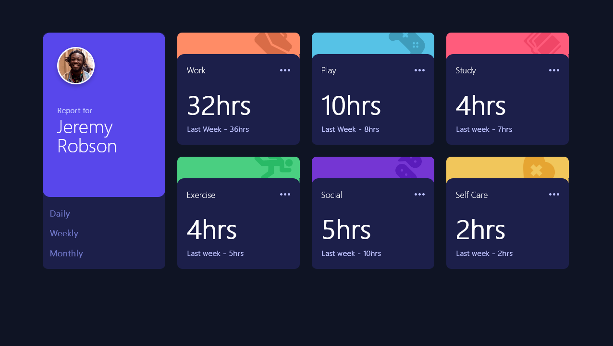
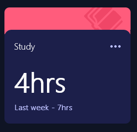

# Frontend Mentor - Time tracking dashboard solution

This is a solution to the [Time tracking dashboard challenge on Frontend Mentor](https://www.frontendmentor.io/challenges/time-tracking-dashboard-UIQ7167Jw). Frontend Mentor challenges help you improve your coding skills by building realistic projects. 

## Table of contents

- [Overview](#overview)
  - [The challenge](#the-challenge)
  - [Screenshot](#screenshot)
  - [Links](#links)
- [My process](#my-process)
  - [Built with](#built-with)
  - [What I learned](#what-i-learned)
  - [Useful resources](#useful-resources)
- [Author](#author)


## Overview

### The challenge

Users should be able to:

- View the optimal layout for the site depending on their device's screen size
- See hover states for all interactive elements on the page
- Switch between viewing Daily, Weekly, and Monthly stats
### Screenshots

| Desktop      | Mobile |
| ----------- | ----------- |
|     |        |


### Links

- Solution URL: [GitHub - Repository](https://github.com/astragenius/time-tracking-dashboard-FEM)
- Live Site URL: [Live Version at Vercel](https://time-tracking-dashboard-fem-rho.vercel.app/)

## My process

### Built with

| Build With   | Guidelines that I followed| Tools that i have used|
| -------------|---------------------------|-----------------------|
| Semantic HTML5 markup|[MaintainableCSS](https://maintainablecss.com/chapters/semantics/)| [Modern CSS reset](https://piccalil.li/blog/a-modern-css-reset/)
| [SASS - Syntactically Awesome Style Sheets](https://sass-lang.com/)|[SASS Guidelines](https://sass-guidelin.es/#naming-conventions)|[Fluid Typography](https://utopia.fyi/)
| Flexbox|[HTML Best Practices](https://github.com/hail2u/html-best-practices)|[HTML Validator](https://validator.w3.org/nu/?doc=https%3A%2F%2Fofficialmentor.netlify.app%2F)
| CSS Grid|[CSS STyle Guide(Airbnb)](https://github.com/airbnb/css)|[CSS Validator](https://jigsaw.w3.org/css-validator/)
|Mobile-first workflow||[PageSpeed Insights](https://pagespeed.web.dev/)


### What I learned

#### wrapper util class
This wrapper utility class was really helpful to get a flexible and fluid container element that works on landscape and portrait mode and keeps the content centred.


```css
    .wrapper {
        width: 90vw;
        width: clamp(rem(375), 90vw, rem(1440)); /* clamp allows us are more flexible container-with when we use it with viewport units */
        margin-left: auto;
        margin-right: auto;
        padding-right: 1.5rem;
        padding-left: 1.5rem;
    }
```
#### Fluid Typography
I was using in this project the clamp() function to create fluid typography for the h1 and h3 elements, to avoid too many breakpoints to set the correct font size for all screens.
in this example, $font-900 would grow on the widest screen 57px and on the smallest screen it would shrink to 32px.
```css
$font-900: clamp(2.00rem, calc(1.47rem + 2.25vw), 3.50rem);/* 32px to 56px */

$font-800: clamp(1.50rem, calc(1.15rem + 1.50vw), 2.50rem);/*  */
```

#### System Font Stack(Default Fonts)
I was using for the first time the System font stack to provide the default font size for every OS

The Default font size looks better than the browser’s default fonts. I used  @font-face property to set a font-family so it looks a lot cleaner.

```css
@font-face {
  font-family: system;
  font-style: normal;
  font-weight: 300;
  src: local(".SFNSText-Light"), local(".HelveticaNeueDeskInterface-Light"), local(".LucidaGrandeUI"), local("Ubuntu Light"), local("Segoe UI Light"), local("Roboto-Light"), local("DroidSans"), local("Tahoma");
}

body {
  font-family: system;
}
```
#### Invertet Border-radius



This is indeed a tricky design. You have an inverted - border-radius and a background image on the head of the element.

```scss 
.box-bg {
    position: relative;
    height: 45px;
    width: 100%;
    border-radius: 10px 10px 0 0;

    &::before {
        position: absolute;
        content: '';
        height: 20px;
        width: 20px;
        top: 45px;
        right: 0px;
        border-top-right-radius: 14px;
        background-color: transparent;
    }

    &::after {
        position: absolute;
        content: '';
        height: 20px;
        width: 20px;
        left: 0;
        top: 45px;
        border-top-left-radius: 14px;
        background-color: transparent;
    }
    
}

.box-bg--work {
    
    background: $orange-red url(/images/icon-work.svg) no-repeat 160px;

    &::before {
        box-shadow: 0 -11px 0 0 $orange-red;
    }
    &::after {
        box-shadow: 0 -11px 0 0 $orange-red;
    }
}


```

### Useful resources

- [Flexible Wrapper](https://piccalil.li/quick-tip/use-css-clamp-to-create-a-more-flexible-wrapper-utility/) - 

- [Fluid typhography with CSS clamp](https://piccalil.li/tutorial/fluid-typography-with-css-clamp/) 
- [System Font Stack (Default fonts für jedes OS)](https://css-tricks.com/snippets/css/system-font-stack/)
- [Invertet Border-radius](https://blog.logrocket.com/how-to-create-fancy-corners-in-css/)


## Author


- Frontend Mentor - [@astragenius](https://www.frontendmentor.io/profile/astragenius)
- Twitter - [@yourusername](https://www.twitter.com/yourusername)


